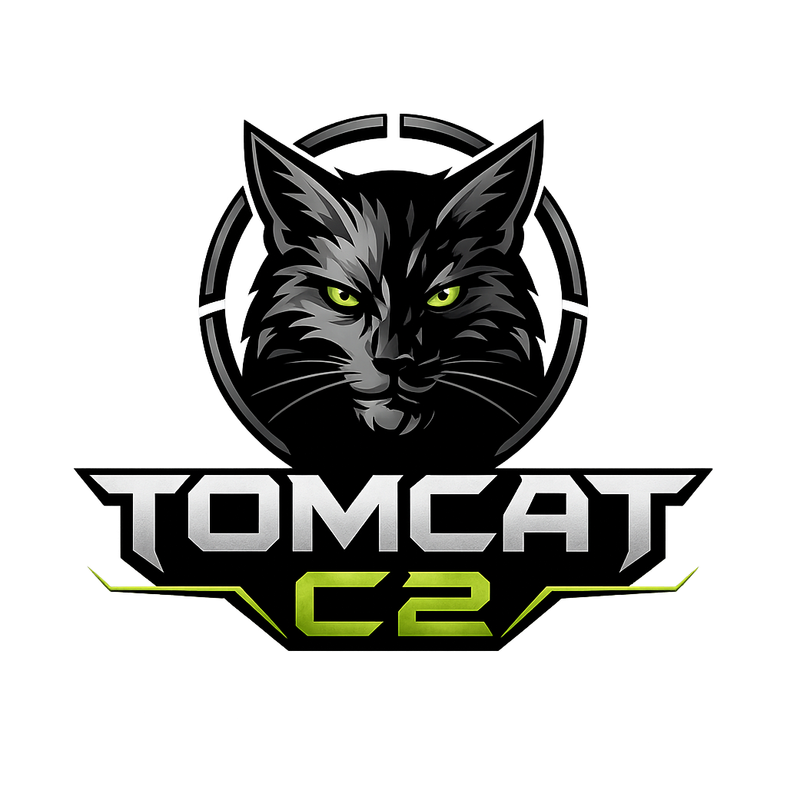

<div align="center">



# TOMCAT-C2 Framework

### Multi-Protocol Command & Control Framework


</div>

---

**Author:** MatrixTM26  
**GitHub:** [MatrixTM26](https://github.com/MatrixTM26)

> [!IMPORTANT]
> Copying without owner permission is illegal. If you want to expand this project, ask the owner for collaboration instead.

---

# Overview

TOMCAT C2 is a multi-protocol Command & Control framework supporting three types of incoming connections on a single port:

- Native TOMCAT agents
- Meterpreter sessions
- Generic reverse shells

The framework supports Mutual TLS (mTLS) for authenticated and encrypted agent communication while also shipping with a built-in PKI infrastructure for certificate generation and management.

TOMCAT-C2 combines multi-session management, encrypted communication, multi-interface administration, and multi-protocol session handling into a single unified framework.

<div align="center">

</div>
---

#  Features

- **Multi-Protocol** — single listener accepts TOMCAT agents, Meterpreter, and reverse shells simultaneously
- **mTLS Support** — mutual TLS with CA-signed client certificates; only authorized agents can connect
- **Fernet Encryption** — encrypted end-to-end communication using symmetric Fernet keys
- **Three Interfaces** — CLI, Flask Web Panel, and Tkinter GUI
- **Built-in PKI** — generate CA certificates, server certificates, and per-agent certificates directly from CLI
- **Agent Packaging** — auto-generates deployable agent folders with certificates and scripts
- **Certificate Management** — generate, revoke, and manage issued certificates
- **File Transfer** — upload and download files between server and agent
- **Session Commands** — sysinfo, screenshot, elevate, upload, download, shell execution, and task management
- **Persistence** — optional Windows Registry and Linux Cron persistence
- **Multi-Session** — manage multiple sessions concurrently
- **Interactive Console** — fully interactive session handling with shell support
- **Cross-Protocol Detection** — automatic session identification based on incoming traffic

---

#  Installation

## Clone Repository

```bash
git clone https://github.com/MatrixTM26/TOMCAT-C2.git
```

## Install Dependencies

```bash
pip install -r requirements.txt
```

---

#  Requirements

```text
Python 3.8+
cryptography
flask
pysocks
```

---

#  Project Structure

```text
TOMCAT-C2
├── AGENT
│   ├── Shell
│   │   ├── shell-2.java
│   │   ├── shell-2.js
│   │   ├── shell-3.java
│   │   ├── shell.asm
│   │   ├── shell.c
│   │   ├── shell.cpp
│   │   ├── shell.cr
│   │   ├── shell.dart
│   │   ├── shell.go
│   │   ├── shell.hs
│   │   ├── shell.java
│   │   ├── shell.js
│   │   ├── shell.md
│   │   ├── shell.pl
│   │   ├── shell.ps1
│   │   ├── shell.py
│   │   └── shell.sh
│   ├── tomcatv2a.bat
│   ├── tomcatv2a.cs
│   ├── tomcatv2a.go
│   ├── tomcatv2a.java
│   ├── tomcatv2a.js
│   ├── tomcatv2a.php
│   ├── tomcatv2a.ps1
│   ├── tomcatv2a.py
│   ├── tomcatv2a.rb
│   ├── tomcatv2a.sh
│   └── tomcatv2a.vbs
├── CHANGELOG.md
├── Certs
│   ├── AgentTCF
│   ├── Metadata.json
│   ├── ca-cert.pem
│   ├── ca-key.pem
│   ├── server-cert.pem
│   └── server-key.pem
├── LICENSE
├── QUICKSTART.md
├── README.md
├── doc
│   └── AUTHORS
├── images
│   └── logo.png
├── install.sh
├── lib
│   ├── config
│   │   ├── Color.py
│   │   ├── Helper.py
│   │   ├── Logo.py
│   │   ├── static
│   │   │   ├── css
│   │   │   │   └── style.css
│   │   │   └── js
│   │   │       ├── script.js
│   │   │       ├── sidebar
│   │   │       │   └── sidebar.js
│   │   │       └── themes
│   │   │           └── theme.js
│   │   └── templates
│   │       └── index.html
│   └── core
│       ├── App
│       │   ├── App.py
│       │   ├── Cli.py
│       │   └── Gui.py
│       └── Systems
│           ├── CertificateManager.py
│           ├── Cryptography.py
│           ├── MultiProtocolServer.py
│           ├── Server.py
│           └── System.py
├── requirements.txt
└── start.py

```

---

#  Quick Start

## 1. Initialize Certificates

Required for mTLS communication.

```bash
python3 start.py --init-certs
```

Specify custom server IP:

```bash
python3 start.py --init-certs --server-host 192.168.1.10
```

---

## 2. Generate Agent Package

```bash
python3 start.py --gen-agent myagent --agent-host 192.168.1.10 --agent-port 4444 --agent-mtls
```

Generated structure:

```text
IMPLANT/MYAGENT/
├── tomcatv2a.py
├── agent-key.pem
├── agent-cert.pem
├── ca-cert.pem
└── README.txt
```

Run agent:

```bash
python3 tomcatv2a.py
```

---

## 3. Start Server

### CLI Mode

```bash
python3 start.py -C
```

### CLI Mode + mTLS

```bash
python3 start.py -C -T
```

### Multi-Protocol Mode

```bash
python3 start.py -C -M -T
```

### Flask Web Panel

```bash
python3 start.py
```

---

#  mTLS Architecture

```text
  C2 Server                               Agent
  ─────────                           ─────────
  ca-cert.pem   ◄── shared trust ──►  ca-cert.pem
  server-key.pem                       agent-key.pem
  server-cert.pem                      agent-cert.pem
       │                                     │
       └──────── TLS mutual auth ─────────┘
```

The Certificate Authority signs both server certificates and agent certificates. During the TLS handshake, both sides verify each other using the same trusted CA.

Agents without valid CA-signed certificates are rejected during SSL negotiation before any protocol communication occurs.

---

#  Multi-Protocol Mode (`-M`)

When Multi-Protocol Mode is enabled, TOMCAT-C2 automatically detects incoming session types based on the first incoming bytes.

| First Bytes        | Detected As         |
| ------------------ | ------------------- |
| TLS ClientHello    | TOMCAT Agent        |
| Meterpreter Header | Meterpreter Session |
| UTF-8 Shell Prompt | Reverse Shell       |

This allows all supported session types to operate simultaneously on a single listening port.

---

#  Certificate Management

## Initialize Certificates

```bash
python3 start.py --init-certs
```

## Generate Single Agent

```bash
python3 start.py -a agent01 -ah 10.0.0.1 -ap 4444 -am
```

## Generate Multiple Agents

```bash
python3 start.py -m -c 5 -u op1 -ah 10.0.0.1 -ap 4444 -am
```

## List Issued Certificates

```bash
python3 start.py -l
```

## Revoke Certificate

```bash
python3 start.py -r agent01
```

Certificates are stored inside:

```text
Certs/
├── AgentTCF/
├── Metadata.json
├── ca-cert.pem
├── ca-key.pem
├── server-cert.pem
└── server-key.pem
```

---

#  CLI Session Commands

| Command           | Description            |
| ----------------- | ---------------------- |
| `sessions`        | List active sessions   |
| `use <id>`        | Open interactive shell |
| `exec <id> <cmd>` | Execute command        |
| `kill <id>`       | Terminate session      |
| `status`          | Server status          |
| `stats`           | Session statistics     |
| `logs`            | View logs              |
| `clear`           | Clear terminal         |
| `help`            | Show help              |
| `exit`            | Shutdown server        |

---

#  Agent Commands

| Command      | Description                 |
| ------------ | --------------------------- |
| `sysinfo`    | System information          |
| `elevate`    | Privilege escalation checks |
| `screenshot` | Capture screenshot          |
| `download`   | Download file               |
| `upload`     | Upload file                 |
| `cd`         | Change directory            |
| `stoptask`   | Stop current task           |
| `back`       | Return to main console      |

---

#  Security Notes

- Keep `ca-key.pem` and `server-key.pem` secure
- Never deploy private server keys to agents
- Each agent receives unique certificates
- Use `--mtls` in production deployments
- Fernet keys regenerate on every server restart

---

#  Another Shell Backdoor For This Project

[SHELL BACKDOOR LIST](https://github.com/MatrixTM26/shell-backdoor)

---

#  Support Me

[](https://ko-fi.com/MatrixTM26)
[](https://trakteer.id/MatrixTM26)
[](https://paypal.me/TeukuMaulana)

---

<p align="center"><b>&copy; 2023-2026 MatrixTM26</b></p>
